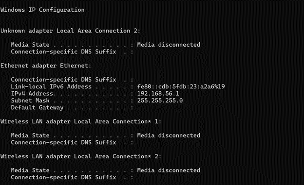
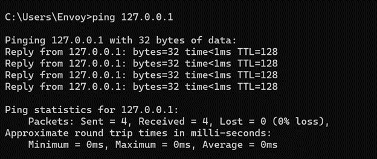
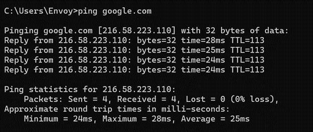
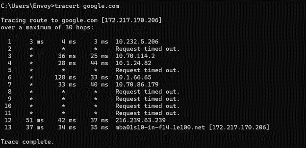
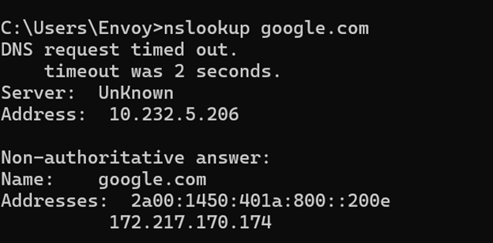

# Network Connectivity & Diagnostics

## Objective
Diagnose and verify network connectivity using basic command-line tools.

## Environment
- OS: Windows 10/11  
- Network: Local network / WiFi  
- Access Level: Standard user / Administrator  

## Tools Used
- Command Prompt  
- ping  
- ipconfig  
- tracert  
- nslookup  

## Procedure

### 1. Check IP configuration
Open Command Prompt and run:
ipconfig

Verify:
- IPv4 address  
- Default Gateway  
- Subnet Mask  

📸 Output:  

---

### 2. Test local connectivity
Run:
ping 127.0.0.1

This checks:
- local TCP/IP stack  

📸 Output:  

---

### 3. Test internet connectivity
Run:
ping google.com

This checks:
- external network access  
- DNS resolution  

📸 Output:  

---

### 4. Trace network path
Run:
tracert google.com

This shows:
- route packets take  
- network hops  

📸 Output:  

---

### 5. Test DNS resolution
Run:
nslookup google.com

This verifies:
- DNS server response  
- domain resolution  

📸 Output:  

---

## Troubleshooting Context

This process is used when users report:

- No internet connection  
- Slow network  
- Unable to access websites  
- DNS errors  

### Example Scenario

A user reports they cannot access the internet.

Steps taken:
1. Checked IP configuration using `ipconfig`
2. Verified local connectivity using `ping 127.0.0.1`
3. Tested external connectivity with `ping google.com`
4. Checked routing using `tracert`
5. Verified DNS resolution using `nslookup`

This helps identify whether the issue is:
- local system issue  
- network connectivity problem  
- DNS failure  
- routing issue  

---

## Findings
- Confirmed network configuration  
- Verified connectivity at different levels  
- Identified potential points of failure  

## Outcome
Successfully diagnosed network connectivity using command-line tools.

## Key Takeaways
- `ipconfig` verifies network configuration  
- `ping` checks connectivity  
- `tracert` identifies network path issues  
- `nslookup` verifies DNS resolution  