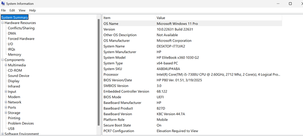
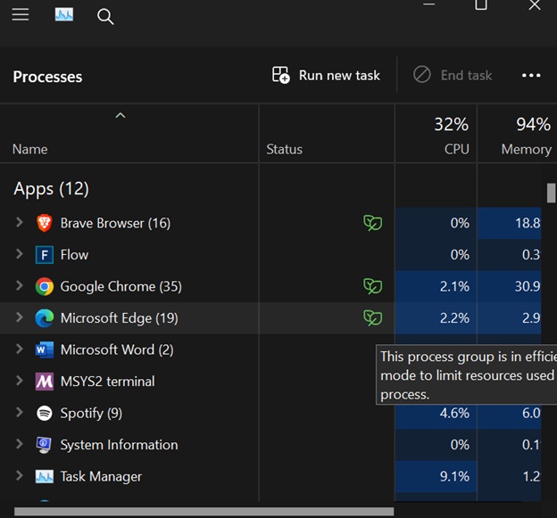
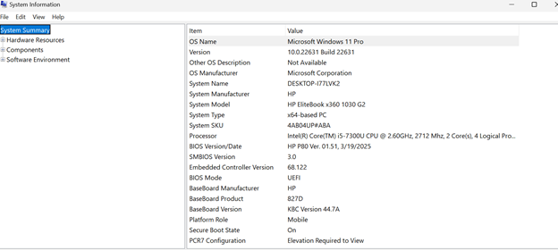
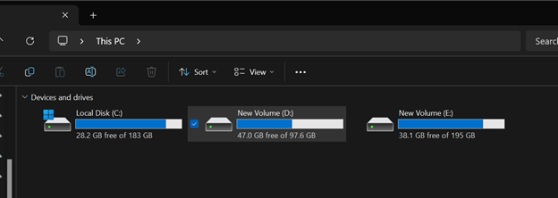

# System Information & Basic Checks

## Objective
Collect and analyze system information to understand system specifications and identify potential performance issues.

## Environment
- OS: Windows 10/11  
- Device Type: Personal Computer / VM  
- Access Level: Administrator  

## Tools Used
- Command Prompt  
- Task Manager  
- System Information (msinfo32)  
- File Explorer  

## Procedure

### 1. Collect system details
Open Command Prompt and run:
systeminfo

This command provides:
- OS version  
- system manufacturer  
- RAM  
- processor details  

📸 Output:  

---

### 2. Analyze running processes
Open Task Manager:

- Press `Ctrl + Shift + Esc`  
- Go to **Processes tab**

Observe:
- CPU usage  
- Memory usage  
- Background processes  

📸 Output:  

---

### 3. View detailed system configuration
Run:
msinfo32

Check:
- system summary  
- hardware resources  
- components  

📸 Output:  

---

### 4. Check disk usage
- Open File Explorer  
- Navigate to **This PC**

Observe:
- available storage  
- used space  

📸 Output:  

## Findings
- Identified system specifications including CPU, RAM, and OS version  
- Observed active processes and system resource usage  
- Reviewed detailed system configuration  
- Evaluated disk usage and available storage  

## Outcome
Successfully gathered and analyzed system-level information required for basic troubleshooting and system assessment.

## Key Takeaways
- System information is the first step in troubleshooting  
- Task Manager helps identify performance bottlenecks  
- Disk usage directly impacts system performance  
- Built-in tools provide essential diagnostics without additional software  