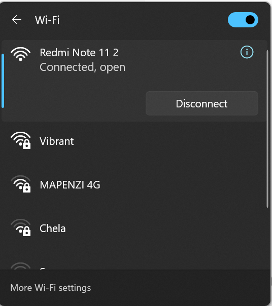
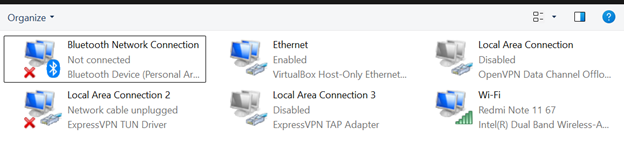
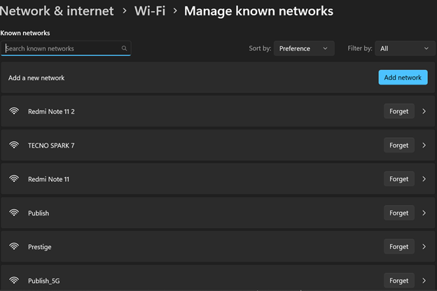
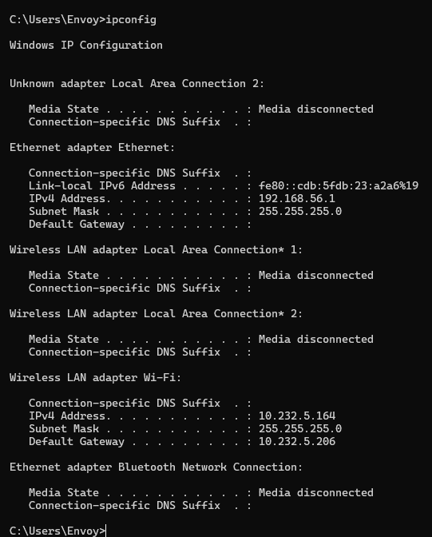
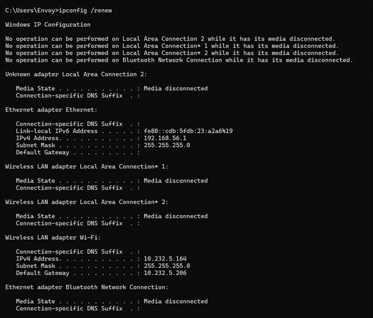
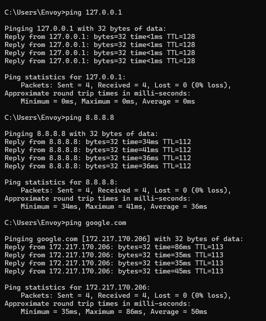
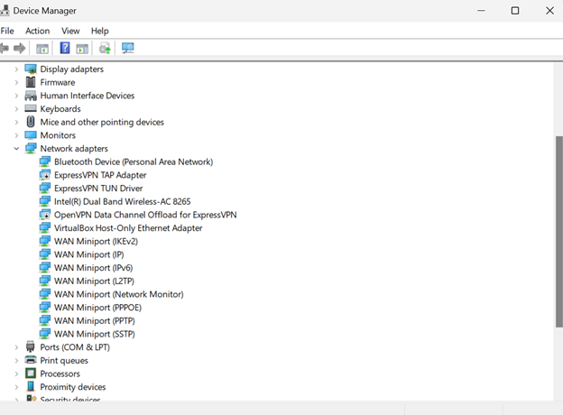

cat << 'EOF' > tickets/wifi-issue.md
# Ticket Scenario: User Cannot Connect to Wi-Fi

## Ticket Summary
A user reports that their laptop cannot connect to the office Wi-Fi network.

## Ticket Details
- Ticket Type: Network Connectivity
- Priority: Medium
- Device: Windows 10/11 Laptop
- Reported By: End User
- Status: Resolved

## User Complaint
The user states that their laptop shows available wireless networks, but connection to the company Wi-Fi fails repeatedly.

## Initial Assessment
Possible causes include:
- incorrect Wi-Fi password
- disabled wireless adapter
- invalid saved wireless profile
- IP configuration issue
- DHCP failure
- driver issue
- router or access point issue

## Troubleshooting Steps

### 1. Verify the issue
- Confirmed that the laptop could detect nearby Wi-Fi networks
- Confirmed that the user was selecting the correct SSID
- Confirmed connection attempts were failing

---

### 2. Check wireless adapter status
- Opened Network Connections using:
  - Win + R → ncpa.cpl
- Verified that the Wi-Fi adapter was enabled
- Confirmed adapter was not disabled

---

### 3. Forget and reconnect to the network
- Opened Wi-Fi settings
- Removed saved wireless profile
- Re-entered the correct password
- Attempted reconnection

---

### 4. Check IP configuration

Ran:

ipconfig

Reviewed:
- IPv4 address
- Default Gateway
- Subnet Mask

---

### 5. Renew network settings

Ran:

ipconfig /release
ipconfig /renew

Purpose:
- Release current IP
- Request new IP from DHCP

---

### 6. Test connectivity

Ran:

ping 127.0.0.1
ping 8.8.8.8
ping google.com

Checks:
- Local TCP/IP stack
- External connectivity
- DNS resolution

---

### 7. Check for driver issues
- Opened Device Manager
- Expanded Network Adapters
- Verified no warning icons on wireless adapter

---

## Root Cause
The system had an invalid saved wireless profile, preventing proper authentication to the network.

## Resolution
- Removed saved Wi-Fi profile
- Reconnected to correct SSID
- Entered correct credentials
- Verified successful connection

## Verification
- Wi-Fi connected successfully
- Valid IP assigned
- Internet access confirmed
- Ping tests successful

## Prevention / Notes
- Always verify saved credentials first
- Reset wireless profiles when authentication fails
- Update drivers if issue persists
- Document correct SSID for users

## Key Skills Demonstrated
- Network troubleshooting
- Wi-Fi diagnostics
- IP configuration analysis
- DHCP renewal
- Connectivity testing
- Root cause identification
- Technical documentation
EOF